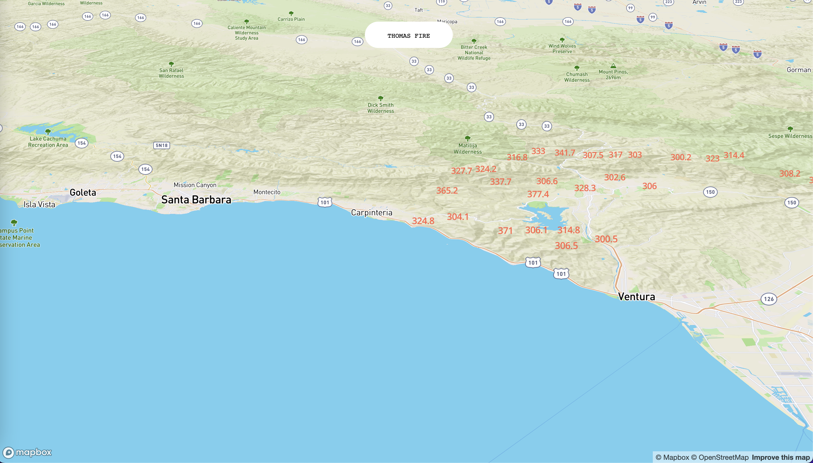
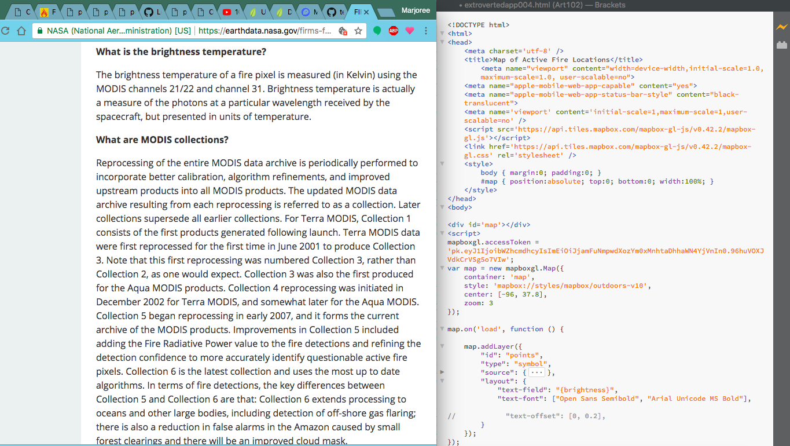

# Fire Tracker App

## Table of contents

- [Overview](#overview)
  - [Assignment](#assignment)
  - [Screenshot](#screenshot)
  - [Links](#links)
- [My process](#my-process)
  - [Built with](#built-with)
  - [What I learned](#what-i-learned)
  - [Continued development](#continued-development)
  - [Useful resources](#useful-resources)
- [Author](#author)
- [Acknowledgments](#acknowledgments)

## Overview
This project was built using HTML, JS, mapbox API, and some DOM manipulation. At UCSB Fall 2017, I built this app using mapbox API to
show on a map where a nearby fire would be. I actually got it to work... only I was building it when the Thomas Fire affected the
area. While we faced many challenges as classmates and neighbors within the community, I was building this app with a first-hand
experience testing my own product out in my own situation. It wasn't very advanced, but it was a very surreal moment for me. At that time, I had no knowledge of Git and GitHub or deployment. This hindered my ability to showcase this and a few other projects
prior to my graduation in 2018 and my continued self-education. 

*I am writing this 4 years since I first created this app in 2017 to better understand and improve the projects that got me started in web development.*

### Assignment

[Class Agenda](https://rosebud.arts.ucsb.edu/~jevbratt/teaching/f_17/)

This project satisfied the final project titled 'Extroverted App'. Here is the prompt:
> Make an app that in some way address connectedness related to using mobile devices. The message of your app could be positive, negative or neutral about mobile media’s connecting qualities. Your app should technically connect to the world around the user by using one of the following: geolocation, real time data from some other site or sharing information between users (by saving, and retrieving, it from our server). Think of the App as an art project. Yet it can also be a functional tool.

My 2017 proposal:
> For an extroverted App, I would like to develop an app that would map out natural disasters in real time like a fire. I would like to develop something that would grant people the ability to see what is going on around the world in real time. Natural disasters happen more often than we would like them to and often times, people are unaware of what is going on.

While the class was centered around building apps, the projects were assigned with so much creative liberties to them that I was
excited and a little overwhelmed with the unlimited ideas and implementation of design and use.

### Screenshot

### Links
- [App](https://thomas-fire-2017.netlify.app/)
- [Documentation](https://github.com/mfargas/thomas-fire-2017.git)

## My Process
### Built With
Tools used:
- Vanilla JavaScript
- HTML
- CSS Styling
- Dom Manipulation
- MapBox API
- NASA DataBases

### What I Learned
I learned to use APIs and JSON databases in a very basic way at this time. This was prior to ES6 rolling out and since then, I have
learned proper ES6 syntax and uses that I did not know at the time.

#### Using MapBox
MapBox was the mapping API I used to display a global map and display a layer property of a heatmap depicting fires from the NASA database. This was all done completely free of charge, I had the choice to use Google Maps API as well, however since 2018 they have since started charging for services related to Google Maps. As a low-income college student at the time, that was my preference.

`
 const map = new mapboxgl.Map({
   container: 'map',
   style: 'mapbox://styles/mapbox/outdoors-v10',
   center: [-96, 37.8]
})
`

I used the Flyto interaction handler I found through the MapBox documentation and attached it to a button. This was done using DOM
manipulation through the 'click' event on the button.

`
document.getElementById('flyTo').addEventListener('click', () => {
      map.flyTo({
      center: [
         -119.480602,
         34.502864
      ],
      pitch: 60,
      zoom: 9,
      essential: true
   })
})
`

The Layer I created to depict the fires was as follows with the brightness levels being depicted in areas of fires:

`
map.on('load', () => {
   map.addLayer({
      "id": "points",
      "type": "symbol",
      "source": {
            "type": "geojson",
            "data": {
               "type": "FeatureCollection",
               "features": [{
               "type": "Feature",
   "geometry": {
      "type": "Point",
      "coordinates":  [ -93.116,17.834 ]
   },
   "properties": {
   "brightness":300.5,
   "scan":3.9,
   "track":1.8,
   "acq_date":"2017-12-08",
   "acq_time":510,
   "satellite":"T",
   "confidence":26,
   "version":"6.0NRT",
   "bright_t31":288.5,
   "frp":30.4,
   "daynight":"N"
   }
  }
}
`

At the time I created this project with no knowledge of git or Github, I also chose to document my process through screenshots of my process. Here is a relevant screenshot of my process building and researching in 2017:

### Continued Development
Since revisiting this project with the knowledge I have now, I see that my API key is visible for the public to see and this I've learned is not good practice. Since this is a free service offered by MapBox API, there is no harm to me or my account, however this would be very problematic should this API charge upon each use of the API key. It can easily be taken and used by another developer and it would come at a cost to me. This is something I am working to change in this app. 

I had trouble at the time of implementation retrieving data from NASA's API Database based on the user's location, and since there was an active fire nearby at the time of creation I used static data to show the fire to the class. Long-term this obviously does not do what I initially intended and our class time was interrupted by the fire within our own community. The fire eventually affected the electricity and environment around us which not only was scary but disrupted our time building and creating. Now without that interruption or focus on other classes/assignments I will work to:
- fix the geoJSON implementation to show real-time data
- turn the brightness data into a visual representation of a fire.

### Useful Resources
Along with the teachings of Lisa Jevbratt-who I would continue to learn from in other course-I utilized documentation such as:
- [Mapbox Docs](https://docs.mapbox.com/)
- [NASA Active Fire Data](https://firms.modaps.eosdis.nasa.gov/active_fire/)

Professor Jevbratt provided the following resources(all of which are no longer available online):
- Learning JavaScript, Shelley Powers (e-book)
- JavaScript: The Definitive Guide, David Flanagan
- Mobile JavaScript Application Development, Adrian Kosmaczewski
- Building iPhone Apps with HTML, CSS, and JavaScript, Jonathan Stark
- Building Android Apps with HTML, CSS, and JavaScript, Jonathan Stark, Brian Jepson
- Head First Mobile Web, Lyza Danger Gardner; Jason Grigsby
- Programming the Mobile Web, Maximiliano Firtmans
- Designing Mobile Interfaces, Steven Hoober, Eric Berkman
